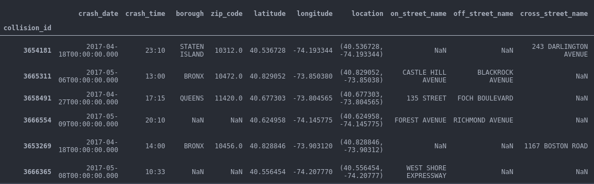

# Data_preprocessing---NYC_Motor_Vehicle_Crashes

- Repository: nyc-crashes
- Type of Challenge: Consolidation
- Duration: 2 days
- Deadline: dd/mm/yy H:i AM/PM
- Deployment strategy :
- Github page
- Team challenge : solo
 

## Goal
The main goal is to do the cleaning and the preprocessing the dataset for a future use by a machine learning model.

#### The Mission

Bill de Blasio, mayor of New York City, is in a bit of a pickle. Indeed, his police department, the NYPD, collected information about all the traffic accidents that happened in New York City. However, they are too busy eating doughnuts to correctly encode each traffic indicent, and so it happens that the dataset that we got here is quite dirty, has a lot of missing values and can't be used by a machine learning model as is. 
So Mr. de Blasio needed my help to clean the dataset and make it usable by a machine learning.

#### Objectives
- Be able to use `pandas`.
- Be able to clean a data set
- Be able to do prepare a data set for a machine learning model

## The dataset
The dataset has already been downloaded for us in ), which has 100000 rows for around 21.5MB. The full file is more than 10x larger but it is not required to use the full file. 
However, it was asked to use at least 100 000 rows for the final version
The dataset registered all crashes in the city from 2013 to 2020 with related informations in the differents columns. 

Below a quick of its head 

  
More details

[View file]([NYC%20Motor%20Vehicle%20Crashes/data_100000.csv](URL)) 

#### Initial informations

- Shape: (100000, 28) 
- Missing values : 871235 

## Data cleaning
This step understand many sub-steps: 

##### Empty value cleaning
The first step is finding missing values. In fact, after import and display 
the dataset, one must find all the missing values and how to deal with them. 

In this dataset, processed as following: 

   1- find the missing values for every column 

   | #  | Column              | Null % |
   | -: | :------------------ | -------: |
   | 0  | crash_date            | 0.000    |
   | 1  | crash_time              | 0.000    |
   | 2  | borough | 35.026    |
   | 3  | zip_code               | 35.034    |
   | 4  | latitude        | 8.035    |
   | 5  | longitude         | 8.035    |
   | 6  | location                | 8.035    |
   | 7  | on_street_name     | 26.009    |
   | 8  | off_street_name           | 52.875    |
   | 9  | cross_street_name           | 74.033    |
   | 10 | number_of_persons_injured             | 0.000    |
   | 11 | number_of_persons_killed        | 0.000    |
   | 12 | number_of_pedestrians_injured              | 0.000    |
   | 13 | number_of_pedestrians_killed         |  0.000    |
   | 14 | number_of_cyclist_injured     | 0.000    |
   | 15 | number_of_cyclist_killed       | 0.000    |
   | 16 | number_of_motorist_injured       | 0.000    |
   | 17 | number_of_motorist_killed  | 0.000    |
   | 8  | contributing_factor_vehicle_1           | 0.371    |
   | 9  | contributing_factor_vehicle_2           | 19.243    |
   | 10 | contributing_factor_vehicle_3             | 91.239    |
   | 11 | contributing_factor_vehicle_4        | 97.760    |
   | 12 | contributing_factor_vehicle_5              | 99.333   |
   | 13 | vehicle_type_code1         |  0.740    |
   | 14 | vehicle_type_code2     | 26.589   |
   | 15 | vehicle_type_code_3       | 91.671    |
   | 16 | vehicle_type_code_4       | 97.853    |
   | 17 | vehicle_type_code_5  | 99.354    |
   
   dtype: float64
    

   2- apply a first selection to remove columns with more than 75% missing 
     `df.drop(df.columns[df.apply(lambda col: col.isnull().sum()) > 75000], axis= 1, inplace= True)` 

   3- fill the missing values with `unspecified` for most of the remaining columns 

##### Dealing with date column
At second, splitting `crash_date` column and crating new columns from it 

  - day_crash
  - month_crash
  - year_crash

##### Combine, split and consolidate columns
Finally, rearrange columns values of `contributing_factor_vehicle` and `vehicle_type_code`.

this gives us for the `vehicle_type_code` columns, those final values:
     `['utility', 'private', 'motorcycle', 'taxi', 
       'pick_up', 'ambulance', 'tractor', 'bus', 
       'unspecified', 'box truck', 'bike', 'delivery',
       'van', 'other', 'police', 'truck', 'convertible',
       'scooter', 'lift', 'fire_truck']`
       
Also, combine `off_street` and `cross_street` columns and it gives `near_street`

## Data Preprocessing
As the cleaning phase, in the preprocessing also work were doing following steps

##### Normalization
The Normalization is applied in integer type columns

 | #  | Column              | type |
 | -: | :------------------ | -------: |
|number_of_persons_injured | int |
|number_of_persons_killed | int |
|number_of_pedestrians_injured | int |
|number_of_pedestrians_killed | int |
|number_of_cyclist_injured | int |
|number_of_cyclist_killed | int |
|number_of_motorist_injured | int |
|number_of_motorist_killed | int |

##### Caracteristics before split:
after first steps of preprocessing, we have:
- Shape = (100000, 28)
- Missing values = 0

##### Get dummies
for a future use of the dataset by machine learning, 
it was applied get dummies in it and the result is affect to a variable `dummies`
   - shape: 100000 rows × 157 columns
   
##### Splitting Data
the dataset was splitted into `Test` and `Train` for a future use by machine learning too.

`Train`, 80% of the data, will be used to train the machine learning algorythm,

`Test`, 20%, is for testing the accuratie of the algorythm

Shapes:
 - Train : (80000, 28)
 - Test : (20000, 28)
 

## Saving Data into csv files
##### saving cleaned dataset versions 
As we saved to versions of the dataset ( apply of get_dummies),
results are stored in to csv files named by `with_dummies` and 
`without_dummies` to specify to which one we applied the get dummies.

-without dummies

[View file]([without_dummies.csv](URL)) 

- with dummies
[View file]([with_dummies.csv](URL)) 

##### Train Test data
Also, after split, results are stored into to files : `train.csv` and `test.csv`

-train
[View file]([train.csv](URL)) 

-test
[View file]([NYC%20Motor%20Vehicle%20Crashes/data_100000.csv](URL)) 

## Usage
This project was made with Jupyter Notebooks.
It is composed by: 
- Data cleaning and preprocessing : see data_processing.ipynb
- Dataset import folder
- Csv files of final results
- README.md file

## Installation
To this Jupyter Notebooks, you need these python module:
- matplotlib.pyplot
- numpy
- pandas
- datetime
- seaborn
- cv2
- sklearn
- csv

## To do's
- Machine Learning prevision

